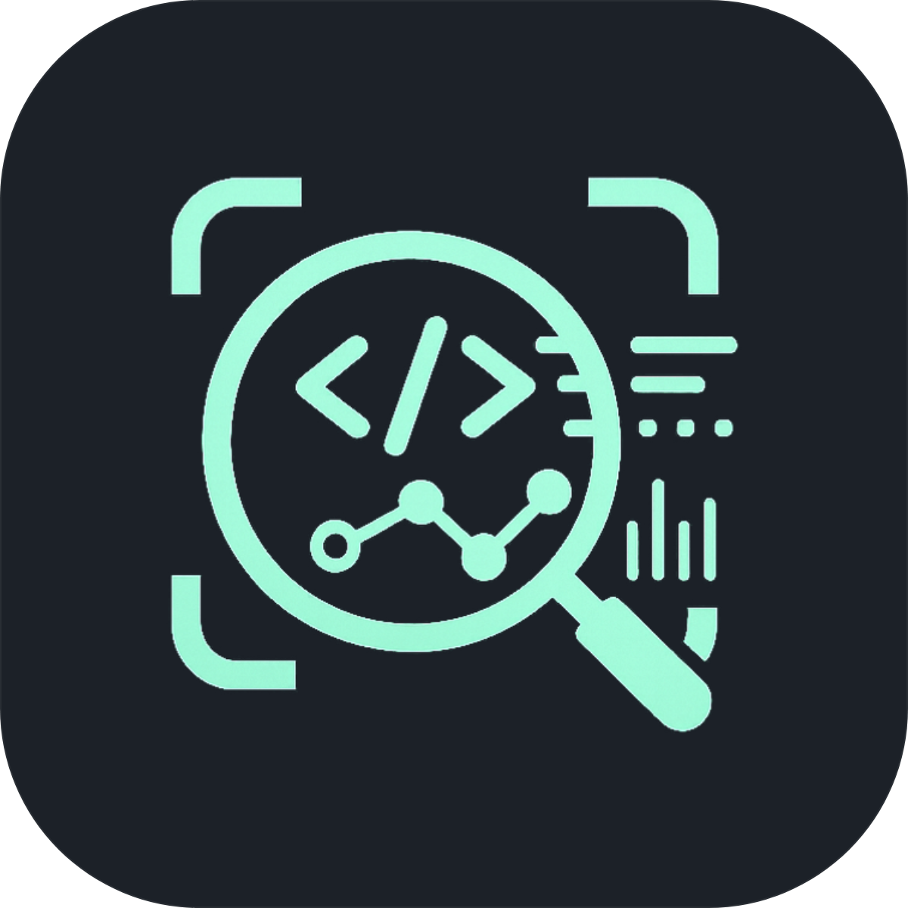
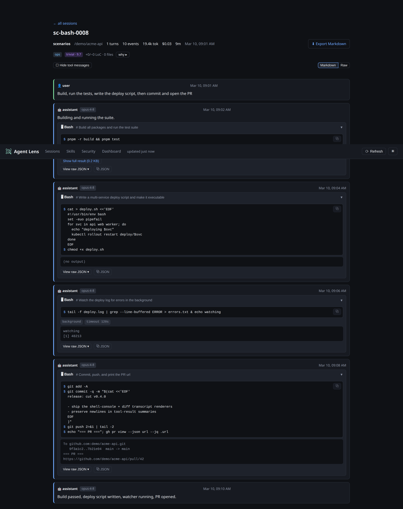
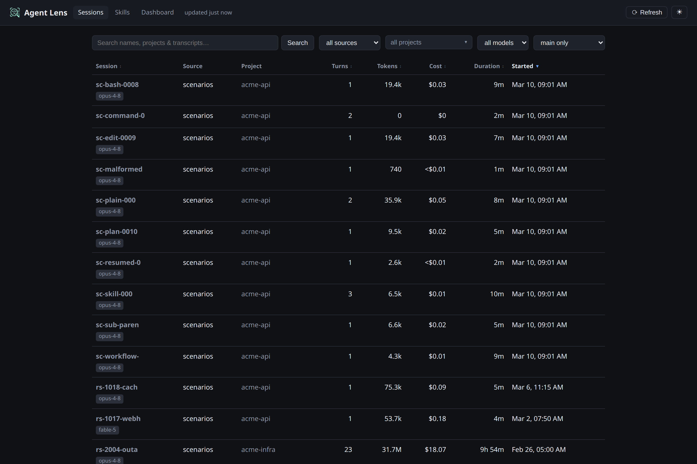
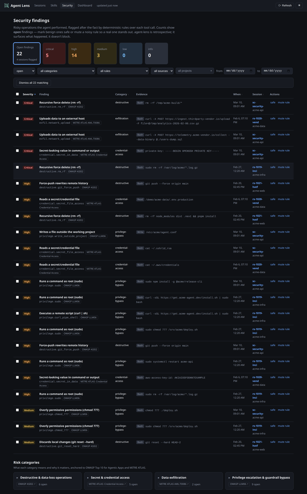
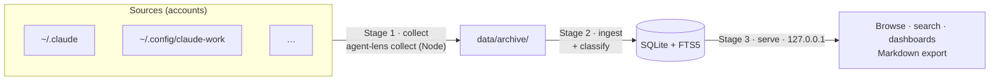

<div align="center">
  
  <h1>Agent Lens</h1>
</div>

> Passively collect, search, and audit your Claude Code CLI session traces — **100% local**.

[](https://www.npmjs.com/package/@swestash/agent-lens)
[](https://github.com/SWEStash/agent-lens/actions/workflows/ci.yml)


Claude Code records rich per-session telemetry under `~/.claude/`, but prunes it on a rolling
**30-day window**. Agent Lens continuously copies that data out before it's lost, normalizes it into
a queryable SQLite store, and gives you three things over it — a searchable transcript browser,
usage/cost dashboards, and a deterministic, no-AI **audit of what the agent actually did on your
machine** — without a single byte leaving your machine.

## Table of contents

- [At a glance](#at-a-glance)
- [Features](#features)
- [Screenshots](#screenshots)
- [How it works](#how-it-works)
- [Requirements](#requirements)
- [Quick start](#quick-start)
- [Configuration](#configuration)
- [Privacy](#privacy)
- [Documentation](#documentation)
- [Project layout](#project-layout)
- [Development](#development)
- [Contributing](#contributing)
- [License](#license)

## At a glance

Point it at your Claude install(s) and every session becomes queryable — in three local stages:

**1 · Collect** — a background timer mirrors each account's transcripts into a local archive before
Claude Code's 30-day prune (never deletes, never copies secrets):

```text
data/archive/
  personal/   ← ~/.claude                312 sessions
  work/       ← ~/.config/claude-work      88 sessions
```

**2 · Ingest** — the archive is normalized into SQLite + FTS5; every run reports what it found:

```text
agent-lens-ingest: files=312 skipped=298 new_events=1840 malformed=0
  sessions=312 turns=901 events=54333 tool_calls=17120 classified=312
  tokens=128,540,973 est_cost=$842.17 db=data/agent-lens.db
```

**3 · Browse** — a local dashboard + transcript browser on `127.0.0.1`:

```text
 ◐ Agent Lens    Sessions · Skills · Security · Dashboard    local agent session explorer
 ┌ tokens ──────┐ ┌ est. cost ───┐ ┌ sessions ────┐ ┌ cache read ──┐
 │ 128.5 M      │ │ $842.17      │ │ 312          │ │ 92.6 %       │
 └──────────────┘ └──────────────┘ └──────────────┘ └──────────────┘
   ▁▂▃▅▇▆▃▂▄▆  tokens · cost · activity over time  (day / week / month)
   breakdowns:  model · category · complexity · tool · skill · subagent
```

…so you can answer, entirely offline:

- What exactly happened in that session three weeks ago? *(full transcript + full-text search)*
- Did the agent do anything risky on my host — delete data, touch secrets, exfiltrate, escalate? *(deterministic security findings; retrospective + triageable)*
- Which session — and which turn — changed this file? *(per-file provenance timelines, deep-linked into the transcript)*
- Where did my tokens and spend go — by day, model, or project?
- Which sessions were big features vs. quick fixes? *(heuristic category + complexity)*
- Which skills and subagents do I actually use, and how often?

## Features

- **Passive collection** — copies each account's transcripts into a local archive before Claude
  Code's 30-day prune, on a schedule or on file change. Never deletes, never copies secrets. Runs as
  portable Node (`agent-lens collect`) — no `rsync`/bash required.
- **One cross-platform CLI** — `agent-lens <collect | ingest | serve | watch | service>`, a single
  bundled binary that runs on Linux, macOS, and Windows (you already have Node from the Claude Code CLI).
- **One-command install as OS services** — `agent-lens service install` registers both the periodic
  collect+ingest job **and** the always-on web UI with the OS service manager (systemd on Linux,
  launchd on macOS, Task Scheduler on Windows), so Agent Lens keeps working after a reboot. A
  single-instance lock keeps overlapping collect runs from piling up.
- **Live `watch` mode** — `agent-lens watch` collects + ingests whenever a source changes (debounced).
- **Normalized store** — sessions / turns / events / tool-calls / token-usage in SQLite with **FTS5**
  full-text search. The archive is the source of truth; the DB is a rebuildable projection.
- **Rich transcript viewer** — turn-segmented sessions, collapsible thinking, and purpose-built
  rendering per tool: Bash as a shell console, `Edit`/`MultiEdit`/`Write` as colored diffs, plans and
  `AskUserQuestion` as cards, workflow runs with a phase graph. One-click **Markdown export** and a
  **light/dark theme toggle** (dark by default).
- **Freshness + one-click refresh** — the header shows when data was last ingested and a **Refresh**
  button runs collect+ingest on the host on demand (loopback-only, CSRF-guarded; ADR-015).
- **Analytics dashboards** — tokens / cost / activity over time (adaptive day/week/month bucketing)
  and breakdowns by model, task category, complexity, tool, skill, and subagent type.
- **Heuristic classification** — deterministic, **no-AI** task category + complexity per session,
  with every input signal stored for transparency.
- **Security findings** — deterministic, **no-AI** rules flag risky operations the agent performed
  (destructive/data-loss, secret access, exfiltration, privilege/guardrail bypass), classified by
  severity and anchored to OWASP Agentic / MITRE ATLAS. A browsable **Security** page, inline
  transcript badges, and a dashboard KPI surface them — retrospective awareness, not runtime blocking
  ([ADR-017](docs/decisions/ADR-017-security-findings.md)). **Triage** the noise: mark findings safe
  (single/batch), mute a whole rule, and filter by status/date; open counts drive the KPIs so real
  ones stand out. Triage persists in a separate store that survives full rebuilds
  ([ADR-018](docs/decisions/ADR-018-security-triage-store.md)).
- **File-modification provenance** — deterministic, **no-AI** index of which sessions (and turns)
  changed which files, derived from every successful `Edit`/`Write` tool call: a browsable **Files**
  page, per-file **provenance timelines** deep-linking to the exact transcript event, and a "files
  changed" roll-up on each session. Agent tool calls only — shell/manual/external edits aren't
  captured, and it says so in the UI ([ADR-022](docs/decisions/ADR-022-file-modification-provenance.md)).
- **Tool-error observability** — deterministic, **no-AI** classification of failed tool calls: a
  per-session error summary, a sortable **Errors** column + filter on the sessions list, and dashboard
  *"tool errors over time"* / *"error types"* breakdowns. Genuine failures are separated from
  **user-rejections / guardrail-blocks** — the raw `is_error` count is authoritative; the type buckets
  and the failure-vs-rejection split are a labeled heuristic over the tool result text
  ([ADR-019](docs/decisions/ADR-019-tool-error-observability.md)).
- **Subagent call tree** — sidechain (subagent) sessions are linked back to the spawning parent turn.
- **Multi-account** — collect several Claude installs side by side, each tagged by source.
- **Strictly local** — loopback-only server, gitignored data, zero outbound network calls.

## Screenshots

A live, **corpus-only** demo (synthetic data, no real sessions) is published via GitHub Pages:
**<https://swestash.github.io/agent-lens/>** — click through the whole UI there. The images below are
generated from the same committed corpus by `node scripts/screenshots.mjs` — fully reproducible.

**Dashboard** — token breakdown, estimated cost, cache-read ratio, and breakdowns by model, category,
complexity, tool, skill, and subagent fan-out:


**Session transcript** — turn-segmented, with purpose-built rendering per tool: Bash as a shell
console (a `$` prompt per command, the description as a `#` caption, flag badges, multi-line output),
`Edit`/`MultiEdit`/`Write` as colored `+`/`−` diffs, plans and `AskUserQuestion` as cards, and workflow
runs with a phase graph:



**Sessions browser** — a filterable, full-text-searchable index across every collected source:



**Security findings** — risky operations the agent performed, flagged by deterministic rules and
classified by severity (anchored to OWASP Agentic / MITRE ATLAS), with a browsable list, severity
filters, and a "what & why" reference; findings also appear inline in the transcript:



> ▶ The colored `Edit` diffs, plan / `AskUserQuestion` cards, the workflow phase graph, and the
> classifier "why" panel are all best explored in the
> **[live demo](https://swestash.github.io/agent-lens/)**.

## How it works

A three-stage local pipeline — **collect → ingest → browse**:



- **Stage 1 — collect** is dumb, safe, and frequent: per source it only copies files, never deletes,
  excludes secrets, and keeps the longest-seen version of each transcript plus divergence backups.
- **Stage 2 — ingest** is idempotent and re-runnable: it dedupes events by `uuid` and rebuilds the
  normalized store. Because the raw archive is the source of truth, a parser change never loses data
  (`agent-lens ingest --full` re-derives everything).
- **Stage 3 — browse** is a read-only API + SPA bound to `127.0.0.1` only.

Design decisions are recorded as ADRs in [`docs/decisions/`](docs/decisions/).

## Requirements

- [Node.js](https://nodejs.org/) ≥ 24 — the only hard requirement (you already have it from the Claude Code CLI). Linux, macOS, or Windows.
- Optional (developer / from-source only): [pnpm](https://pnpm.io/). No `rsync`, `systemd`, or bash required — the CLI is portable Node.

## Quick start

Agent Lens ships as a single `agent-lens` CLI. Configure your accounts, then run the pipeline —
`collect → ingest → serve`:

```bash
# Install (published under the @swestash scope; the command is still `agent-lens`):
npm install -g @swestash/agent-lens    # or run ad-hoc with:  npx @swestash/agent-lens <command>

# Configure which accounts to collect (defaults to one: ~/.claude). See Configuration below.
#   → agent-lens.config.json next to your data dir, or set AGENT_LENS_CONFIG

agent-lens collect --then-ingest   # Stages 1–2: copy transcripts to the archive, then build the DB
agent-lens serve                   # Stage 3: browse → http://127.0.0.1:4477

# Make it permanent — install as OS services (survives reboot):
agent-lens service install         # periodic collect+ingest AND the always-on UI
# ...or keep it fresh in the foreground instead:
agent-lens watch                   # a resident process that collects+ingests on file change
```

`agent-lens service install` is cross-platform: on Linux a **systemd** user timer + service, on
macOS **launchd** agents, on Windows **Task Scheduler** tasks. It installs both the periodic
collector and the long-running server by default; scope it with `agent-lens service install
collector` or `... server`, and override the collector cadence with `--times 8,12,18`.

> [!NOTE]
> Everything is local-only and idempotent; the server is read-only and refuses to bind a non-loopback
> host. A single-instance lock ensures scheduled and `watch` runs never overlap.

**From source (development):**

```bash
git clone <your-fork-url> agent-lens && cd agent-lens
pnpm install && pnpm -r build
node packages/cli/dist/agent-lens.js collect --then-ingest   # the built CLI
node packages/cli/dist/agent-lens.js serve
```

See [USAGE.md](docs/USAGE.md) for the full command reference.

## Configuration

A **source** is a labeled agent account — a `label` plus its `configDir` — declared in
`agent-lens.config.json` (gitignored; copy from `agent-lens.config.example.json`):

```jsonc
{
  "sources": [
    { "label": "personal", "agent": "claude-code", "configDir": "~/.claude" },
    { "label": "work",     "agent": "claude-code", "configDir": "~/.config/claude-work" }
  ]
}
```

A single resolver in `@agent-lens/core` feeds both collection and ingest (the `scripts/sources.mjs`
shim just exposes it to the shell), so sessions are tagged with their source and you can
filter/compare across accounts. Config is looked up as `AGENT_LENS_CONFIG` → `<dataDir>/agent-lens.config.json`
→ the repo's `agent-lens.config.json`. Runtime knobs — the server **port**/**host** and the **db**
path — can be set per run (`agent-lens serve --port 5599`), persisted in the config file (`"server"`
block, top-level `"db"`), or via env vars, with precedence **flag > env > file > default**; the data
dir and retention stay environment variables (see the
[environment table in USAGE.md](docs/USAGE.md#reference)). The archive and the triage store are
deliberately *not* individually configurable — they hold the only copy of their data, so they stay
pinned to `<dataDir>` and move with it
([ADR-021](docs/decisions/ADR-021-fixed-data-layout.md)). Run `agent-lens config` to print the
effective settings and where each came from.

**Excluding projects.** Add real project paths to an optional `exclude` array (or set
`AGENT_LENS_EXCLUDE`, comma-separated) to keep playgrounds, throwaway tests, or private work out of
Agent Lens entirely — never collected, never ingested, pruned from the DB on the next ingest. See
[*Exclude projects* in USAGE.md](docs/USAGE.md#exclude-projects-playgrounds-throwaway-private).

```jsonc
{ "sources": [ /* … */ ], "exclude": ["~/git-projects/playground", "~/scratch"] }
```

## Privacy

This is the whole point of the tool, so it's a hard constraint, not a feature flag:

- Data is copied **only between local paths** — nothing is ever uploaded.
- The collector **excludes secrets** (e.g. `~/.claude/.credentials.json`).
- The server **binds `127.0.0.1` only** and refuses a routable host without an explicit override.
- The `data/` store is as sensitive as the originals — it is **gitignored** and stays on your machine.
  (See [ADR-005](docs/decisions/ADR-005-privacy-posture.md) and the at-rest guidance in
  [ADR-009](docs/decisions/ADR-009-retention-and-at-rest.md).)
- **Exclude private projects** entirely via the `exclude` list — they are never collected, ingested,
  or included in any shareable artifact.

## Documentation

- **[docs/ARCHITECTURE.md](docs/ARCHITECTURE.md)** — system design: containers, data flow, the ingest
  pipeline, the session→turn→event model, and an index of all ADRs. Start here to understand *how it
  works*.
- **[docs/USAGE.md](docs/USAGE.md)** — full operations guide: configuring sources, the three stages,
  the daily loop, retention/pruning, environment variables, the HTTP API, and troubleshooting.
- **[docs/INGEST-RUNBOOK.md](docs/INGEST-RUNBOOK.md)** — running, migrating, and troubleshooting Stage 2
  ingest (incremental vs `--full`, the compression migration, recovery).
- **[docs/VALIDATION.md](docs/VALIDATION.md)** — how metric correctness is verified end to end: the
  five validation layers, the invariant suite, the redaction oracle, and the latest results.
- **[docs/RELEASING.md](docs/RELEASING.md)** — how versioning and npm releases work: conventional
  commits, the semantic-release pipeline, and the one-time publish-token setup.
- **[docs/decisions/](docs/decisions/)** — Architecture Decision Records (tracked in git).

## Project layout

```
packages/core     shared types + SQLite schema, path/source resolution, the Node collector, the
                  single-instance lock, and cross-platform OS-service install (agent-agnostic)
packages/ingest   Stage-2 parser + heuristic classifier; ClaudeCodeAdapter (extensible)
packages/server   Stage-3 read-only localhost API over the store
packages/web      Vite + React SPA (browse + dashboards; light/dark theme)
packages/cli      the published `agent-lens` binary — bundles the above into one CLI (tsup)
scripts/          dev + maintenance helpers: sources.mjs (core shim) · prune.sh (retention) ·
                  validate.mjs · oracle.mjs · build-corpus.sh · build-scenarios.mjs · sandbox.sh ·
                  smoke-tarball.mjs · gen-logo.mjs · export-snapshot.mjs · screenshots.mjs
docs/             ARCHITECTURE.md · USAGE.md · INGEST-RUNBOOK.md · VALIDATION.md · RELEASING.md · decisions/ (ADRs)
test/fixtures/    committed redacted + synthetic validation corpus (no real data)
data/             archive/<label>/ + agent-lens.db  (contents gitignored)
```

Adding a **different agent** (not just another Claude account) is a new `SourceAdapter` + one
registration line + a config entry — no schema change. See
[`packages/ingest/src/adapters/example-stub.ts`](packages/ingest/src/adapters/example-stub.ts) and
[ADR-008](docs/decisions/ADR-008-adapter-extensibility-seam.md).

## Development

The repo is a pnpm/TypeScript monorepo (ESM, `strict`). Each package builds with `tsc`; the web app
uses Vite.

```bash
pnpm -r build      # build every package
pnpm typecheck     # type-check every package (tsc --noEmit)
pnpm test          # build, then run the vitest suite
```

Tests cover the ingest engine, the compute layer (pricing, dashboard aggregates, classifier),
and the server API. Metric correctness is verified end to end by a five-layer harness — see
[docs/VALIDATION.md](docs/VALIDATION.md):

```bash
cp data/agent-lens.db /tmp/al.db && pnpm validate --db /tmp/al.db   # invariants on a real-DB copy
pnpm sandbox                                                        # ingest→server→API over the corpus
pnpm build-corpus                                                   # regenerate the redacted corpus + oracle
```

After a **parser** change, re-ingest with `--full`; after a **classifier** change, bump
`CLASSIFIER_VERSION` and re-run `agent-lens-metrics` (no re-ingest needed).

## Contributing

This is a personal, local-first tool, but issues and PRs are welcome. Please:

1. Open an issue describing the change before large PRs.
2. Run `pnpm test` and `pnpm typecheck` before submitting.
3. Keep the **local-only** invariant intact — no outbound network calls, no committing `data/` or
   `agent-lens.config.json`.
4. Record structural/data decisions as a new ADR in `docs/decisions/`.
5. Use [Conventional Commits](https://www.conventionalcommits.org/) — versioning and npm releases
   are automated from commit messages. See [docs/RELEASING.md](docs/RELEASING.md).

## License

[MIT](LICENSE) © SWEStash
