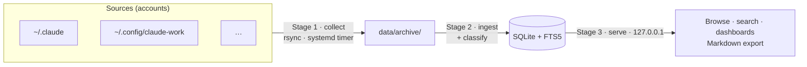

# 🔎 Agent Lens

> Passively collect, browse, and analyze your Claude Code CLI session traces — **100% local**.


Claude Code records rich per-session telemetry under `~/.claude/`, but prunes it on a rolling
**30-day window**. Agent Lens continuously copies that data out before it's lost, normalizes it into
a queryable SQLite store, and gives you a browsable transcript viewer plus analytics dashboards —
without a single byte leaving your machine.

## Table of contents

- [At a glance](#at-a-glance)
- [Features](#features)
- [How it works](#how-it-works)
- [Requirements](#requirements)
- [Quick start](#quick-start)
- [Configuration](#configuration)
- [Privacy](#privacy)
- [Documentation](#documentation)
- [Project layout](#project-layout)
- [Development](#development)
- [Contributing](#contributing)
- [License](#license)

## At a glance

Point it at your Claude install(s) and every session becomes queryable — in three local stages:

**1 · Collect** — a background timer mirrors each account's transcripts into a local archive before
Claude Code's 30-day prune (never deletes, never copies secrets):

```text
data/archive/
  personal/   ← ~/.claude                312 sessions
  work/       ← ~/.config/claude-work      88 sessions
```

**2 · Ingest** — the archive is normalized into SQLite + FTS5; every run reports what it found:

```text
agent-lens-ingest: files=312 skipped=298 new_events=1840 malformed=0
  sessions=312 turns=901 events=54333 tool_calls=17120 classified=312
  tokens=128,540,973 est_cost=$842.17 db=data/agent-lens.db
```

**3 · Browse** — a local dashboard + transcript browser on `127.0.0.1`:

```text
 🔎 Agent Lens          Sessions · Dashboard            local agent session explorer
 ┌ tokens ──────┐ ┌ est. cost ───┐ ┌ sessions ────┐ ┌ cache read ──┐
 │ 128.5 M      │ │ $842.17      │ │ 312          │ │ 92.6 %       │
 └──────────────┘ └──────────────┘ └──────────────┘ └──────────────┘
   ▁▂▃▅▇▆▃▂▄▆  tokens · cost · activity over time  (day / week / month)
   breakdowns:  model · category · complexity · tool · skill · subagent
```

…so you can answer, entirely offline:

- Where did my tokens and spend go — by day, model, or project?
- Which sessions were big features vs. quick fixes? *(heuristic category + complexity)*
- Which skills and subagents do I actually use, and how often?
- What exactly happened in that session three weeks ago? *(full transcript + full-text search)*

## Features

- **Passive collection** — a user `systemd` timer `rsync`s each account's transcripts into a local
  archive before Claude Code's 30-day prune. Never deletes, never copies secrets.
- **Normalized store** — sessions / turns / events / tool-calls / token-usage in SQLite with **FTS5**
  full-text search. The archive is the source of truth; the DB is a rebuildable projection.
- **Transcript viewer** — turn-segmented sessions, collapsible thinking, expandable tool calls, and
  one-click **Markdown export**.
- **Analytics dashboards** — tokens / cost / activity over time (adaptive day/week/month bucketing)
  and breakdowns by model, task category, complexity, tool, skill, and subagent type.
- **Heuristic classification** — deterministic, **no-AI** task category + complexity per session,
  with every input signal stored for transparency.
- **Subagent call tree** — sidechain (subagent) sessions are linked back to the spawning parent turn.
- **Multi-account** — collect several Claude installs side by side, each tagged by source.
- **Strictly local** — loopback-only server, gitignored data, zero outbound network calls.

## How it works

A three-stage local pipeline — **collect → ingest → browse**:



- **Stage 1 — collect** is dumb, safe, and frequent: per source it only copies files, never deletes,
  excludes secrets, and keeps the longest-seen version of each transcript plus divergence backups.
- **Stage 2 — ingest** is idempotent and re-runnable: it dedupes events by `uuid` and rebuilds the
  normalized store. Because the raw archive is the source of truth, a parser change never loses data
  (`pnpm ingest --full` re-derives everything).
- **Stage 3 — browse** is a read-only API + SPA bound to `127.0.0.1` only.

Design decisions are recorded as ADRs in [`docs/decisions/`](docs/decisions/).

## Requirements

- Linux (developed against Ubuntu 24.04 LTS+)
- [`rsync`](https://rsync.samba.org/) 3.x · `systemd` (user instance) · [Node.js](https://nodejs.org/) ≥ 22 · [pnpm](https://pnpm.io/)

## Quick start

```bash
git clone <your-fork-url> agent-lens && cd agent-lens
pnpm install && pnpm -r build

# Configure which accounts to collect (defaults to one: personal -> ~/.claude)
cp agent-lens.config.example.json agent-lens.config.json   # then edit

# One-off run of the whole pipeline:
scripts/collect.sh         # Stage 1 — copy transcripts into data/archive/
pnpm ingest                # Stage 2 — build data/agent-lens.db (incremental; --full rebuilds)
pnpm serve                 # Stage 3 — browse → http://127.0.0.1:4477

# …or automate it with user systemd units (run even while logged out):
scripts/setup-systemd.sh install            # all (default): collect+ingest timer AND the web server
scripts/setup-systemd.sh install data-load  # only the collect+ingest timer (Stages 1–2)
scripts/setup-systemd.sh install web-ui     # only the web UI + API server (Stage 3)
```

> [!NOTE]
> Collection and ingest are local-only and idempotent; the server is read-only and refuses to bind a
> non-loopback host. The `data-load` timer runs collection **and** ingest in the background, so day
> to day you only need the server — `pnpm serve`, or install it once with `setup-systemd.sh install web-ui`.

## Configuration

A **source** is a labeled agent account — a `label` plus its `configDir` — declared in
`agent-lens.config.json` (gitignored; copy from `agent-lens.config.example.json`):

```jsonc
{
  "sources": [
    { "label": "personal", "agent": "claude-code", "configDir": "~/.claude" },
    { "label": "work",     "agent": "claude-code", "configDir": "~/.config/claude-work" }
  ]
}
```

The same resolver (`scripts/sources.mjs`) feeds both collection and ingest, so sessions are tagged
with their source and you can filter/compare across accounts. Runtime knobs (ports, paths, retention
window) are environment variables — see the [environment table in USAGE.md](docs/USAGE.md#reference).

## Privacy

This is the whole point of the tool, so it's a hard constraint, not a feature flag:

- Data is copied **only between local paths** — nothing is ever uploaded.
- The collector **excludes secrets** (e.g. `~/.claude/.credentials.json`).
- The server **binds `127.0.0.1` only** and refuses a routable host without an explicit override.
- The `data/` store is as sensitive as the originals — it is **gitignored** and stays on your machine.
  (See [ADR-005](docs/decisions/ADR-005-privacy-posture.md) and the at-rest guidance in
  [ADR-009](docs/decisions/ADR-009-retention-and-at-rest.md).)

## Documentation

- **[docs/ARCHITECTURE.md](docs/ARCHITECTURE.md)** — system design: containers, data flow, the ingest
  pipeline, the session→turn→event model, and an index of all ADRs. Start here to understand *how it
  works*.
- **[docs/USAGE.md](docs/USAGE.md)** — full operations guide: configuring sources, the three stages,
  the daily loop, retention/pruning, environment variables, the HTTP API, and troubleshooting.
- **[docs/INGEST-RUNBOOK.md](docs/INGEST-RUNBOOK.md)** — running, migrating, and troubleshooting Stage 2
  ingest (incremental vs `--full`, the compression migration, recovery).
- **[docs/decisions/](docs/decisions/)** — Architecture Decision Records (tracked in git).

## Project layout

```
packages/core     shared types + SQLite schema (agent-agnostic)
packages/ingest   Stage-2 parser + heuristic classifier; ClaudeCodeAdapter (extensible)
packages/server   Stage-3 read-only localhost API over the store
packages/web      Vite + React SPA (browse + dashboards)
scripts/          collect.sh · prune.sh · setup-systemd.sh · sources.mjs
systemd/          user service + timer units
docs/             ARCHITECTURE.md · USAGE.md · INGEST-RUNBOOK.md · decisions/ (ADRs)
data/             archive/<label>/ + agent-lens.db  (contents gitignored)
```

Adding a **different agent** (not just another Claude account) is a new `SourceAdapter` + one
registration line + a config entry — no schema change. See
[`packages/ingest/src/adapters/example-stub.ts`](packages/ingest/src/adapters/example-stub.ts) and
[ADR-008](docs/decisions/ADR-008-adapter-extensibility-seam.md).

## Development

The repo is a pnpm/TypeScript monorepo (ESM, `strict`). Each package builds with `tsc`; the web app
uses Vite.

```bash
pnpm -r build      # build every package
pnpm typecheck     # type-check every package (tsc --noEmit)
pnpm test          # build, then run the vitest suite
```

Tests cover the ingest engine (golden synthetic JSONL → expected rows, including subagent linkage and
zero-turn handling) and the server API (`app.inject()` smoke tests). After a **parser** change,
re-ingest with `--full`; after a **classifier** change, bump `CLASSIFIER_VERSION` and re-run
`agent-lens-metrics` (no re-ingest needed).

## Contributing

This is a personal, local-first tool, but issues and PRs are welcome. Please:

1. Open an issue describing the change before large PRs.
2. Run `pnpm test` and `pnpm typecheck` before submitting.
3. Keep the **local-only** invariant intact — no outbound network calls, no committing `data/` or
   `agent-lens.config.json`.
4. Record structural/data decisions as a new ADR in `docs/decisions/`.

## License

[MIT](LICENSE) © SWEStash
