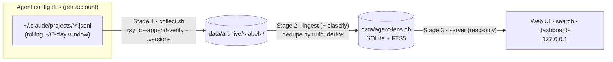
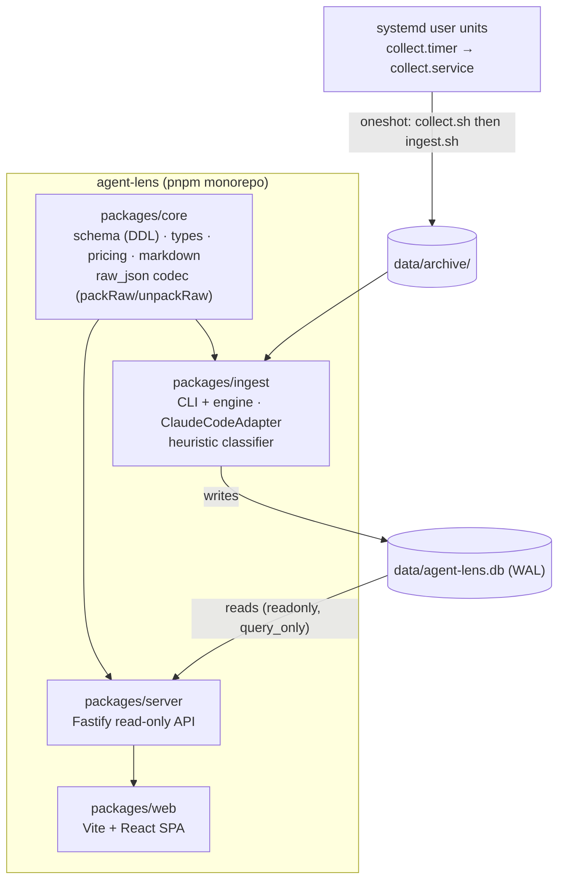
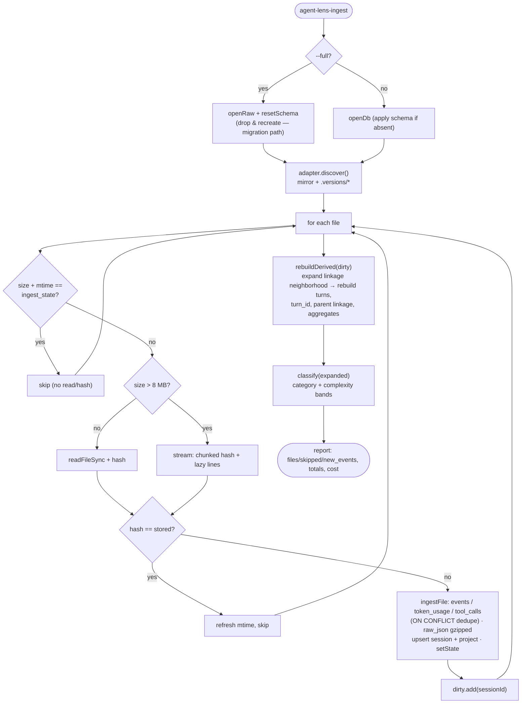
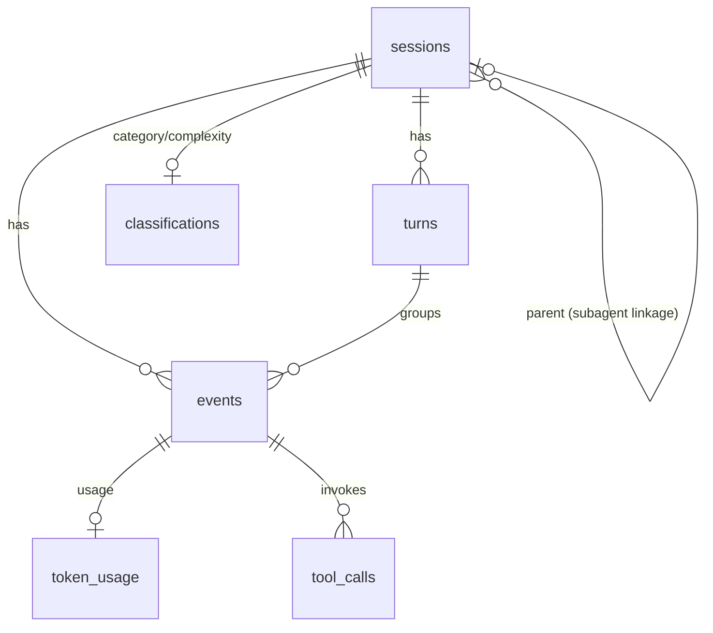

# Agent Lens — Architecture Specification

The canonical system design for Agent Lens: what the pieces are, how data flows, and how the ingest
pipeline scales. For *operations* (commands, env vars, troubleshooting) see
[INGEST-RUNBOOK.md](INGEST-RUNBOOK.md) and the [Operations Guide](USAGE.md); for the *why* behind each
choice see the [Architecture Decision Records](decisions/). This document is the structural source of
truth those guides link back to.

## 1. Context

Agent Lens turns the rolling, soon-pruned session traces that coding agents (today: Claude Code) write
to disk into a durable, queryable store you browse locally. It is a **local-only** (ADR-005), three-stage
pipeline: a dumb durable **collector**, a re-runnable **ingest** parser, and a read-only **browse**
server. The archive is the source of truth; the database is a derived projection that can always be
rebuilt from it (ADR-001).

## 2. Containers

`core` is the shared, agent-agnostic contract (schema + types) every other package depends on; adding a
new agent is a new `SourceAdapter` in `ingest` with no schema change (ADR-003/008).

**Concurrency.** SQLite runs in WAL mode (`PRAGMA journal_mode = WAL`). Ingest is the single writer (a
oneshot that opens, writes, closes); the server is a long-lived reader opened read-only
(`readonly`, `query_only = ON`). WAL lets the reader and writer coexist; the dirty-session rebuild
(ADR-010) shortens the writer's transaction and therefore the lock window the reader can observe.

## 3. Ingest runtime (Stage 2)

Ingest discovers transcript files, skips the unchanged ones cheaply, writes events idempotently, then
rebuilds only the derived rows that could have changed. The archive is re-read, never mutated.

Key properties (full rationale in [ADR-010](decisions/ADR-010-incremental-scalable-ingest.md)):

- **Stat short-circuit.** Unchanged `size`+`mtime` ⇒ skip without reading or hashing — per-run I/O
  tracks the delta, not the whole archive + every `.versions` snapshot.
- **Idempotent writes.** Events are keyed by `uuid` with `ON CONFLICT DO NOTHING`; ingesting the mirror
  and all divergence backups deduplicates to the maximal history (ADR-001/002).
- **Dirty-session rebuild.** Only sessions touched this run — expanded to their subagent-linkage
  neighborhood (spawned children + spawner parents, by fixpoint) — have their turns/aggregates/linkage
  and classification recomputed. `--full` rebuilds everything.
- **Streaming.** Files over 8 MB stream in 64 KB chunks with a boundary-safe `StringDecoder`, bounding
  memory; the streaming hash equals the whole-file hash so skip decisions are path-independent.

### Session → turn → event hierarchy

The store is event-grained (ADR-003): `session › turn › event`. A *turn* is one user prompt →
assistant completion, derived in `rebuildDerived`. Subagent (sidechain) sessions are linked back to the
spawning parent turn via the `Task`/`Agent` tool call's `spawned_session_id`. `raw_json` is stored
gzip-compressed (ADR-011) and decoded on read by `unpackRaw`.

## 4. Decisions index

| ADR | Topic |
|-----|-------|
| [001](decisions/ADR-001-two-stage-collection.md) | Two-stage collection: raw archive + re-runnable parser |
| [002](decisions/ADR-002-collection-mechanism.md) | Collection mechanism: rsync `--append-verify` + `.versions` |
| [003](decisions/ADR-003-data-model-and-store.md) | Agent-agnostic normalized model in SQLite + FTS5 |
| [004](decisions/ADR-004-heuristic-classification.md) | Heuristic (no-AI) category & complexity classification |
| [005](decisions/ADR-005-privacy-posture.md) | Local-only privacy posture |
| [006](decisions/ADR-006-stack.md) | Implementation stack (TypeScript/Node, SQLite, Vite+React) |
| [007](decisions/ADR-007-labeled-sources.md) | Labeled sources (multiple accounts) |
| [008](decisions/ADR-008-adapter-extensibility-seam.md) | Adapter extensibility seam |
| [009](decisions/ADR-009-retention-and-at-rest.md) | Retention window and at-rest stance |
| [010](decisions/ADR-010-incremental-scalable-ingest.md) | Incremental, volume-scalable ingest |
| [011](decisions/ADR-011-compressed-raw-json.md) | Compressed `raw_json` at rest (gzip BLOB) |
