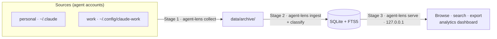
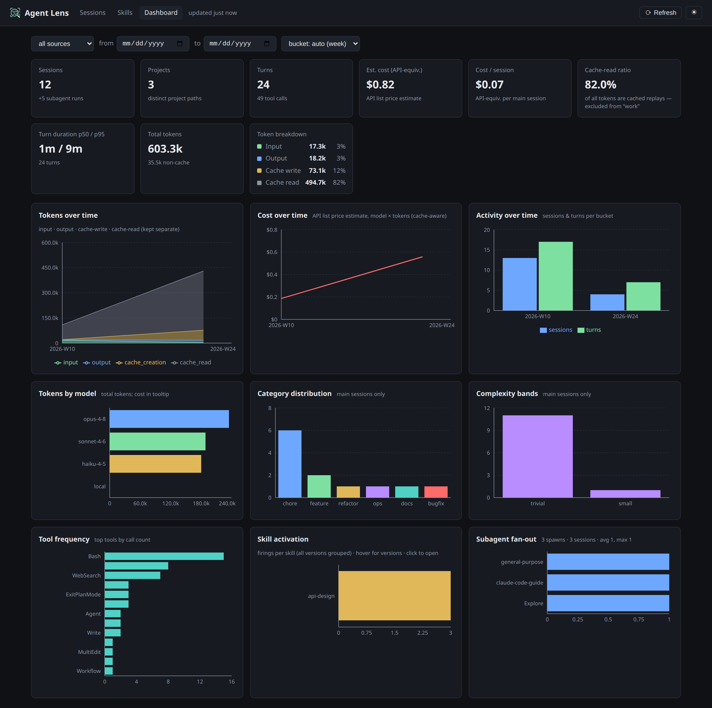
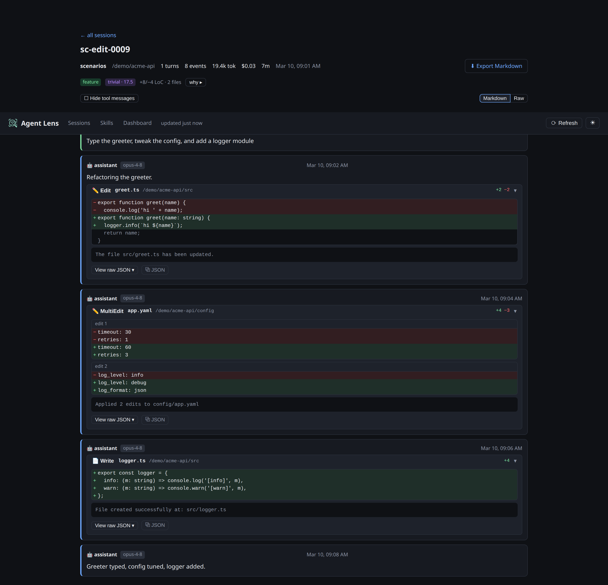
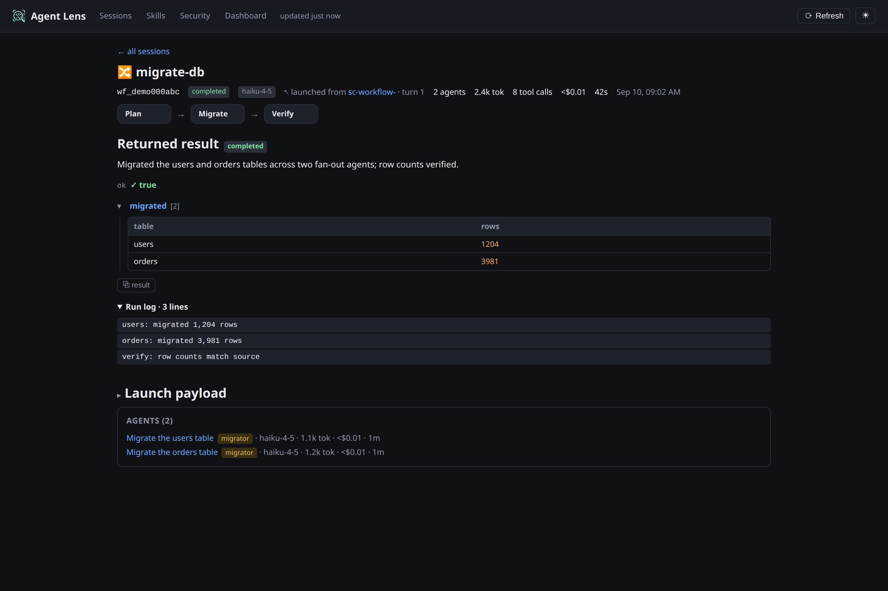

# Agent Lens — Operations Guide

How to run the tool day to day. Agent Lens is a three-stage local pipeline:
**collect → ingest → browse**. Nothing leaves your machine.



## Requirements

- `node` >= 24 — the only hard requirement (Linux, macOS, or Windows). You already have it from the Claude Code CLI.
- Optional, from-source/developer only: `pnpm`. The legacy bash collector also uses `rsync` 3.x + `systemd` (Linux); the Node CLI needs neither.

## Install

Agent Lens is one `agent-lens` CLI. Two ways to get it:

```bash
# End users (published under the @swestash scope; the command stays `agent-lens`):
npm install -g @swestash/agent-lens    # then run `agent-lens <command>`
#   or, ad-hoc, without installing:  npx @swestash/agent-lens <command>

# From source (development):
cd /path/to/agent-lens
pnpm install && pnpm -r build
node packages/cli/dist/agent-lens.js <command>   # the built CLI
```

Below, `agent-lens <command>` means either the installed binary or `node packages/cli/dist/agent-lens.js <command>` from a source build. The subcommands are `collect`, `ingest`, `serve`, `watch`, `metrics`, and `service`.

## Upgrade

Nothing is destroyed on upgrade: the archive under `<dataDir>/archive` is the source of truth and the
SQLite DB is a derived projection, so you can always rebuild it (`agent-lens ingest --full`).

```bash
# End users (npm):
npm install -g @swestash/agent-lens@latest
agent-lens collect --then-ingest            # pick up any new data + new file types

# From source:
cd /path/to/agent-lens
git pull && pnpm install && pnpm -r build
agent-lens collect --then-ingest
```

Running as a service (`agent-lens service install`)? After upgrading the binary, restart it so the new
code is live — `systemctl --user restart agent-lens-server.service` (Linux), or restart the launchd /
Task Scheduler entry on macOS / Windows — and the background collect+ingest timer refreshes the DB on
its next tick (or click **Refresh** in the UI to do it now).

**Schema changes.** Each release stamps a `SCHEMA_VERSION`. A normal incremental `ingest` applies
additive schema changes automatically (`CREATE … IF NOT EXISTS`) and picks up newly-collected file
types on its next run, so most upgrades need nothing special. Run a one-time `agent-lens ingest --full`
only when a release note calls for it (a change to *existing* tables); because the archive is the
source of truth, a full rebuild is safe and just re-derives every table from scratch.

## Configure sources (which agent accounts to collect)

A **source** is a labeled agent instance: a `label` + the agent's `configDir`. Multiple local
accounts coexist; each is collected and tagged separately so you can filter/compare in the UI.

```bash
cp agent-lens.config.example.json agent-lens.config.json   # if not already present
```

```jsonc
// agent-lens.config.json  (gitignored — machine-specific)
{
  "sources": [
    { "label": "personal", "agent": "claude-code", "configDir": "~/.claude" },
    { "label": "work",     "agent": "claude-code", "configDir": "~/.config/claude-work" }
  ]
}
```

- `label` must be unique (it names the archive subdir and the UI source filter).
- `configDir` accepts `~` and `$HOME`.
- `agent` is `claude-code` (the only shipped adapter today; see *Adding another agent* below).

The config file is resolved in this order: `AGENT_LENS_CONFIG` → `<dataDir>/agent-lens.config.json`
→ the repo's `agent-lens.config.json` → the built-in default (`~/.claude`). Verify what will be
collected with the resolver shim (a thin wrapper over `@agent-lens/core`):

```bash
node scripts/sources.mjs        # prints: label <TAB> agent <TAB> configDir  (from-source debug tool)
```

## Exclude projects (playgrounds, throwaway, private)

Keep specific projects out of Agent Lens entirely. Add their real cwd paths to an optional
top-level `exclude` array (or set `AGENT_LENS_EXCLUDE` to a comma-separated list to extend at
runtime). The list is honored at **every** stage:

- **collect** never mirrors them into the archive (so private work never leaves the source);
- **ingest** never stores them, and **prunes** any that were ingested before you added them — on the
  next ingest, incremental or `--full`;
- the redacted validation **corpus** never includes them.

```jsonc
// agent-lens.config.json
{
  "sources": [ /* … */ ],
  "exclude": [
    "~/git-projects/playground",
    "~/scratch"
  ]
}
```

Matching is by real path (exact or prefix), so excluding `~/git-projects/playground` also drops
anything under it, including its subagent transcripts. Paths accept `~` and `$HOME`.

```bash
node scripts/sources.mjs --excludes     # prints the resolved exclude paths, one per line
AGENT_LENS_EXCLUDE="$HOME/scratch" agent-lens ingest    # one-off, additive to the config list
```

## Stage 1 — Collect

Copies each source's transcripts into `data/archive/<label>/` before Claude Code prunes them
(rolling 30-day window). Never deletes, never copies secrets, keeps divergence/compaction backups
in `.versions/`. Portable Node (no `rsync`/bash), same append-verify semantics.

```bash
agent-lens collect                 # run one pass now
agent-lens collect --then-ingest   # collect, then immediately ingest (Stage 1 → Stage 2)
```

Keep it current automatically — two options:

**Installed as an OS service (survives reboot).** `agent-lens service` registers the periodic
`collect --then-ingest` **collector** with the OS service manager — a **systemd** user timer on
Linux, a **launchd** agent on macOS, **Task Scheduler** tasks on Windows. (The same command also
installs the long-running server; see [Stage 3](#stage-3--browse).)

```bash
agent-lens service install collector                 # default cadence: 09,13,17,21
agent-lens service install collector --times 8,12,18 # custom hours (0–23, comma-separated)
agent-lens service status collector                  # show the registered job / next run
agent-lens service uninstall collector               # remove it (archive untouched)
```

**Resident (`watch`).** A foreground process that collects+ingests whenever a source changes
(debounced), optionally also on a fixed interval:

```bash
agent-lens watch                  # collect+ingest on file change
agent-lens watch --interval 900   # ...and at least every 15 min
agent-lens watch --poll           # polling fallback for network filesystems
```

A cross-platform single-instance lock (`<dataDir>/.agent-lens.lock`) ensures a scheduled run and a
`watch` cycle never overlap, so a short cadence can't pile up lagged collectors.

## Stage 2 — Ingest

Parses the archive (mirror **and** `.versions/` backups, deduped by event `uuid`) into
`data/agent-lens.db`.

```bash
agent-lens ingest            # incremental — only changed files; rebuilds only touched sessions
agent-lens ingest --full     # drop, recreate, and re-derive everything from the archive
```

Incremental runs skip unchanged files by `size`+`mtime` (no re-read) and rebuild derived tables only for
the sessions touched that run, so a no-op run finishes in well under a second regardless of history size.
Use `--full` after changing parser/classifier logic, after a `SCHEMA_VERSION` bump, or to recover — it
**drops and recreates** the tables, so it doubles as the migration path. The archive is the source of
truth, so rebuilding the DB is always safe.

It prints a summary: `files / skipped / new_events / malformed`, then
`sessions / turns / events / tool_calls / classified`, then `tokens / est_cost`.

> **How it works:** see [ARCHITECTURE.md → Ingest runtime](ARCHITECTURE.md#3-ingest-runtime-stage-2).
> **Running / migrating / troubleshooting:** see the [Ingest Runbook](INGEST-RUNBOOK.md) — including the
> one-time [`raw_json` compression migration](INGEST-RUNBOOK.md#adr-011-compression-migration-one-time).

## Stage 3 — Browse

```bash
agent-lens serve       # → http://127.0.0.1:4477   (read-only, loopback only; foreground)
```

To keep it running in the background (restart on failure/logout, start at boot), install it as a
service on any platform:

```bash
agent-lens service install server     # systemd (Linux) / launchd (macOS) / Task Scheduler (Windows)
agent-lens service status server
agent-lens service uninstall server
```

It binds `127.0.0.1:4477`; set `AGENT_LENS_PORT` / `AGENT_LENS_HOST` before installing and they're
baked into the service (Linux/macOS). On Windows the task starts at logon and, unlike systemd/launchd,
is **not** auto-restarted on crash — it returns on the next logon.

> **Tip:** `agent-lens service install` with no target installs the collector **and** the server at
> once — the one-command "make it work after reboot" setup.

Open the URL. The app has four views (nav tabs): **Sessions** (browse), **Skills**, **Security**
(findings), and **Dashboard** (analytics). The top bar also shows **when data was last ingested** ("updated Xm ago"),
a **Refresh** button that runs collect+ingest on the host on demand (`POST /api/refresh` — a scoped
write-action on the otherwise read-only server; loopback-only + CSRF-guarded, see ADR-015), and a
**light/dark theme toggle** (dark by default; your choice is remembered).
A live, corpus-only demo of these views (no real data) is published at
<https://swestash.github.io/agent-lens/>; the screenshots below are generated from the committed
corpus by `node scripts/screenshots.mjs`.








**Sessions** — you can:

- **Filter** by source, project, model, and kind (main vs subagent), plus multi-select **Security**
  (sessions with a finding of a given severity) and **Errors** (sessions with a failed tool call of a
  given error type — e.g. `command-failed`, `user-rejected`).
- **Full-text search** across all transcripts.
- **Sort** by any column, and **customize columns** via the "Columns" control in the table header
  (show/hide, persisted per browser). Sortable **Security** (worst-severity + finding count) and
  **Errors** (failed-tool-call count) columns are shown by default; **Cost** is hidden by default
  (it still shows on the session detail page).
- Open a session for the **transcript viewer**: turn-segmented, collapsible thinking, expandable
  tool calls, model/subagent tags, a **classification badge** (category + complexity) with a
  collapsible signals panel, and an **error summary** in the header — *"X failed · Y declined/blocked
  of N tool calls"* (the failed-vs-declined split is a heuristic; see [ADR-019](decisions/ADR-019-tool-error-observability.md)).
- **Export** any session to Markdown (⬇ button, or `GET /api/sessions/:id/export.md`).

**Dashboard** (`/dashboard`) — server-side aggregates over the whole store (filter by source and a
date range):

- **KPI cards** — sessions, tokens (split input/output/cache-creation/cache-read), estimated
  cost (cache-aware), and a cache-read-ratio explainer.
- **Timeseries** — tokens, cost, and activity, with **adaptive day/week/month bucketing** that keys
  off the real data span so charts stay bounded as data grows to years.
- **Breakdowns** — by model, task category, complexity band, tool, skill, and subagent type.
  Category/complexity are scoped to *main* sessions (subagent sessions skew read-heavy — see ADR-004).
- **Tool errors** — *"Tool errors over time"* (failed tool calls per bucket, with user-rejections /
  guardrail-blocks kept separate) and an *"Error types"* breakdown. The type buckets and the
  failure-vs-rejection split are a heuristic over the tool result text — see [ADR-019](decisions/ADR-019-tool-error-observability.md).
- **Unpriced models** (e.g. `claude-fable-5`) are surfaced explicitly, not silently zeroed, so cost
  reads as a lower bound rather than a wrong number.

**Security** (`/security`) — risky operations the agent performed, flagged after the fact by
deterministic rules over each tool call (ADR-017), classified by severity and anchored to OWASP
Agentic / MITRE ATLAS. It's retrospective awareness, not runtime blocking. You can:

- **Browse & filter** by severity, category, rule, source, project, date range, and status; findings
  also appear **inline** on the offending tool call in the transcript, with a session banner.
- **Triage** (ADR-018): mark a finding **safe** (single or batched), **dismiss all** matching a
  filter, or **mute a whole rule** (globally or per project/source) to silence a noisy detector. Open
  counts (dismissed + muted excluded) drive the KPIs so real, un-cleared findings stand out. Triage is
  stored in a separate `triage.db` and survives `ingest --full`.

UI development with hot reload (proxies `/api` to the running server):

```bash
pnpm web:dev           # http://127.0.0.1:5173
```

### Metrics & classification

The heuristic classifier (ADR-004 — deterministic, no AI) populates each session's category and
complexity. It runs **automatically at the end of every ingest**. To re-classify an
already-ingested DB *without* re-reading the archive (e.g. after tuning classifier rules), run the
`agent-lens-metrics` bin:

```bash
node packages/ingest/dist/metrics-cli.js     # or the installed `agent-lens-metrics` bin
# prints: classified=<n> classifier_version=<v> db=<path>
```

After changing classifier logic, bump `CLASSIFIER_VERSION` (`packages/ingest/src/classify.ts`) and
re-run the above — no re-ingest needed. After changing *parser* logic instead, re-ingest with
`--full`.

## Typical daily loop

With `agent-lens service install` (or `agent-lens watch`) running, collection **and** ingest happen
in the background, so the DB is already current — just open the UI:

```bash
agent-lens serve
```

Collecting manually instead? Run the full refresh: `agent-lens collect --then-ingest && agent-lens serve`.

## Adding another account

1. Add an entry to `agent-lens.config.json` (`label` + `configDir`).
2. `agent-lens collect --then-ingest`.
3. It appears as a new **source** filter in the UI.

## Adding another agent (type)

The store and parser are agent-agnostic (ADR-003/008). Adding a *new agent type* (not just another
Claude account) takes three steps and **no schema change**:

1. Implement `packages/ingest/src/adapters/<agent>.ts` (the `SourceAdapter` interface:
   `discover()` finds the agent's transcript files; `parseLine()` maps each line to the normalized
   rows). See `packages/ingest/src/adapters/example-stub.ts` for a worked, compile-checked template.
2. Register it in `adapterList` (`packages/ingest/src/run.ts`) — the only wiring point.
3. Add a source with the matching `agent` value to `agent-lens.config.json`.

**Caveat (ADR-007/008):** this covers *ingest/parse* only. Collection (the Node collector in
`packages/core/src/collect.ts`) assumes the Claude-Code layout (`projects/**.jsonl`,
`history.jsonl`, `settings`). An agent whose traces live elsewhere also needs per-agent
**collection** logic.

## Retention

The archive's `projects/` mirror (the source of truth) and the DB grow with use and are kept; the
only unbounded-yet-discardable growth is `.versions/` (divergence/compaction snapshots, deduped into
the DB at ingest). `scripts/prune.sh` removes `.versions/` snapshots older than a window (default
90 days). It is **dry-run by default** and only ever touches `*/.versions/<TS>/` dirs:

```bash
scripts/prune.sh                 # dry run: list what would be removed + reclaimable size
scripts/prune.sh --apply         # actually delete aged snapshots
scripts/prune.sh --days 30 --apply   # narrower window
```

The DB is a derived projection — if a prune ever changes what's available, rebuild it with
`agent-lens ingest --full`. Pruning is manual (run it occasionally); `.versions/` is typically empty.

**At-rest encryption (ADR-009):** Agent Lens does not encrypt the store itself — the `data/` dir is
as sensitive as the originals. Place it on an encrypted volume (LUKS/dm-crypt on Linux, FileVault on
macOS) if you need at-rest protection. See `docs/decisions/ADR-009-retention-and-at-rest.md`.

## Reference

### Environment variables

| Variable | Default | Used by | Purpose |
|---|---|---|---|
| `AGENT_LENS_DATA` | `<repo>/data` | all | base dir for archive + DB |
| `AGENT_LENS_ARCHIVE` | `$AGENT_LENS_DATA/archive` | collect, ingest | archive location |
| `AGENT_LENS_DB` | `$AGENT_LENS_DATA/agent-lens.db` | ingest, server | SQLite path |
| `AGENT_LENS_CONFIG` | `<repo>/agent-lens.config.json` | collect, ingest | sources config path |
| `AGENT_LENS_EXCLUDE` | _(unset)_ | collect, ingest | comma-separated project paths to exclude, additive to the config `exclude` array |
| `AGENT_LENS_PORT` | `4477` | server | HTTP port |
| `AGENT_LENS_HOST` | `127.0.0.1` | server | bind host (loopback) |
| `AGENT_LENS_ALLOW_NONLOCAL` | _(unset)_ | server | required to bind a non-loopback host |
| `AGENT_LENS_VERSIONS_KEEP_DAYS` | `90` | prune | retention window for `.versions/` snapshots |
| `CLAUDE_DIR` | _(unset)_ | collect, ingest | legacy single-source override |
| `AGENT_LENS_LABEL` | `default` | collect, ingest | source label used with the legacy `CLAUDE_DIR` single-source mode |

### Paths

| Path | Contents | Tracked? |
|---|---|---|
| `data/archive/<label>/` | raw transcript mirror + `.versions/` backups | no (gitignored) |
| `data/agent-lens.db` | normalized SQLite store | no |
| `agent-lens.config.json` | your sources | no (`.example` is tracked) |
| `docs/decisions/` | Architecture Decision Records (ADRs) | **yes** |
| `.local/plans/` | phased plans | no (gitignored) |

### HTTP API (read-only, `127.0.0.1`)

| Method · Path | Returns |
|---|---|
| `GET /api/health` | `{ ok: true }` |
| `GET /api/sources` | configured sources + session counts |
| `GET /api/projects` | projects (cwd) + session counts |
| `GET /api/models` | distinct model ids |
| `GET /api/sessions` | filtered, paginated session list (see query params) |
| `GET /api/sessions/:id` | session meta + turns + events (transcript) + classification |
| `GET /api/sessions/:id/export.md` | Markdown export (attachment) |
| `GET /api/dashboard/overview` | KPI aggregates (sessions, split token totals, cost) |
| `GET /api/dashboard/timeseries` | tokens/cost/activity over time (adaptive buckets) |
| `GET /api/dashboard/breakdowns` | by model / category / complexity / tool / skill / subagent / error type |
| `GET /api/workflows/:run_id` | workflow run detail (phase graph, returned result, run log, per-agent rows) |
| `GET /api/skills` | skills list (optional `q`, `source`, `project` filters) |
| `GET /api/skills/:name` | skill detail (content-addressed versions + firings) |
| `GET /api/security/summary` | finding roll-up (open counts by severity/category/rule + reference content) |
| `GET /api/security/findings` | filtered, paginated findings list (see query params) |
| `GET /api/security/mutes` | currently muted rules |

`/api/sessions` query params: `source`, `project`, `model`, `kind` (`main`\|`subagent`),
`q` (full-text), `from`, `to` (date-inclusive), `severity` (comma-separated; sessions with a finding of
that severity), `error_type` (comma-separated; sessions with a failed tool call of that error type),
`sort`, `dir`, `limit` (≤200), `offset`.
`/api/dashboard/*` query params: `source`, `from`, `to`; `timeseries` also accepts `bucket`
(`day`\|`week`\|`month`, otherwise chosen adaptively from the data span).
`/api/security/findings` query params: `severity`, `category`, `rule`, `session`, `source`,
`project`, `from`, `to` (date-inclusive), `status` (`open` default \| `dismissed` \| `muted` \|
`all`), `sort`, `dir`, `limit`, `offset`.

**Write actions** (the exceptions to read-only; loopback-only + CSRF-guarded, see ADR-015/018):
`POST /api/refresh` (collect+ingest), and the security-triage writes `POST /api/security/{dismiss,
reopen,dismiss-matching,mute,unmute}` (which write the separate `triage.db`, never the analytics DB).

## Troubleshooting

- **`ingest` says "archive not found"** — run `agent-lens collect` first (or check
  `AGENT_LENS_DATA`).
- **`serve` says "db not found"** — run `agent-lens ingest` first.
- **Timer not firing while logged out (Linux)** — confirm linger: `loginctl show-user $USER -p Linger`
  should print `Linger=yes`; if not, `loginctl enable-linger $USER`.
- **Re-ingest didn't pick up a parser change** — use `agent-lens ingest --full`.
- **A source shows nothing** — check `node scripts/sources.mjs` resolves its `configDir`, and that
  `data/archive/<label>/projects/` has files.

## Privacy

- Collection only copies between local paths; the server binds `127.0.0.1` and refuses a routable
  host unless `AGENT_LENS_ALLOW_NONLOCAL=1`. No outbound network calls anywhere.
- Secrets (e.g. `~/.claude/.credentials.json`) are never copied.
- `data/` and `agent-lens.config.json` are gitignored — the local store is as sensitive as the
  original transcripts. See `docs/decisions/ADR-005-privacy-posture.md`.
