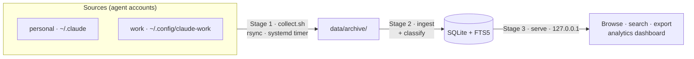

# Agent Lens — Operations Guide

How to run the tool day to day. Agent Lens is a three-stage local pipeline:
**collect → ingest → browse**. Nothing leaves your machine.



## Requirements

- Linux (developed on Ubuntu 24.04 LTS+)
- `rsync` 3.x, `systemd` (user instance), `node` >= 22, `pnpm`

## Install

```bash
cd /home/m4pre/git-projects/swestash/agent-lens
pnpm install
pnpm -r build
```

## Configure sources (which agent accounts to collect)

A **source** is a labeled agent instance: a `label` + the agent's `configDir`. Multiple local
accounts coexist; each is collected and tagged separately so you can filter/compare in the UI.

```bash
cp agent-lens.config.example.json agent-lens.config.json   # if not already present
```

```jsonc
// agent-lens.config.json  (gitignored — machine-specific)
{
  "sources": [
    { "label": "personal", "agent": "claude-code", "configDir": "~/.claude" },
    { "label": "work",     "agent": "claude-code", "configDir": "~/.config/claude-work" }
  ]
}
```

- `label` must be unique (it names the archive subdir and the UI source filter).
- `configDir` accepts `~` and `$HOME`.
- `agent` is `claude-code` (the only shipped adapter today; see *Adding another agent* below).

Verify what will be collected:

```bash
node scripts/sources.mjs        # prints: label <TAB> agent <TAB> configDir
```

## Stage 1 — Collect

Copies each source's transcripts into `data/archive/<label>/` before Claude Code prunes them
(rolling 30-day window). Never deletes, never copies secrets, keeps divergence/compaction backups
in `.versions/`.

```bash
scripts/collect.sh              # run one pass now
```

Run it automatically with **user systemd units** (a few times a day, even when logged out). The
timer fires a oneshot that runs collection (Stage 1) **and then ingest (Stage 2)**, so the DB stays
current with no manual runs. `install` takes a target:

```bash
scripts/setup-systemd.sh install            # all (default): the collect+ingest timer AND the web server
scripts/setup-systemd.sh install data-load  # only the collect+ingest timer (Stages 1–2)
scripts/setup-systemd.sh install web-ui     # only the web UI + API server (Stage 3)
scripts/setup-systemd.sh status             # timer schedule + service status
scripts/setup-systemd.sh uninstall          # stop & remove ALL units (linger/archive untouched)
```

Each `install` enables linger and starts the chosen units. The units are
`agent-lens-collect.{service,timer}` (data-load) and `agent-lens-server.service` (web-ui); the
collect schedule (09:00/13:00/17:00/21:00, with catch-up) lives in `systemd/agent-lens-collect.timer`.

## Stage 2 — Ingest

Parses the archive (mirror **and** `.versions/` backups, deduped by event `uuid`) into
`data/agent-lens.db`.

```bash
pnpm ingest            # incremental — skips files unchanged since last run
pnpm ingest --full     # drop, recreate, and re-derive everything from the archive
```

Use `--full` after changing parser/classifier logic (an incremental run won't rewrite existing
rows). It **drops and recreates** the tables before rebuilding, so it is also the migration path:
a `SCHEMA_VERSION` bump takes effect on the next `--full` run with no separate migration step. The
archive is the source of truth, so rebuilding the DB is always safe.

It prints a summary: `files / skipped / new_events`, then `sessions / turns / events / tool_calls`,
then `tokens / est_cost`.

## Stage 3 — Browse

```bash
pnpm serve             # → http://127.0.0.1:4477   (read-only, loopback only)
```

To keep it running in the background (restart on failure, start at boot), install it as a service
instead: `scripts/setup-systemd.sh install web-ui` (binds `127.0.0.1`; override via
`AGENT_LENS_PORT` / `AGENT_LENS_HOST`).

Open the URL. The app has two views (nav tabs): **Sessions** (browse) and **Dashboard** (analytics).

**Sessions** — you can:

- **Filter** by source, project, model, and kind (main vs subagent).
- **Full-text search** across all transcripts.
- Open a session for the **transcript viewer**: turn-segmented, collapsible thinking, expandable
  tool calls, model/subagent tags, and a **classification badge** (category + complexity) with a
  collapsible signals panel showing how it was derived.
- **Export** any session to Markdown (⬇ button, or `GET /api/sessions/:id/export.md`).

**Dashboard** (`/dashboard`) — server-side aggregates over the whole store (filter by source and a
date range):

- **KPI cards** — sessions, tokens (split input/output/cache-creation/cache-read), estimated
  cost (cache-aware), and a cache-read-ratio explainer.
- **Timeseries** — tokens, cost, and activity, with **adaptive day/week/month bucketing** that keys
  off the real data span so charts stay bounded as data grows to years.
- **Breakdowns** — by model, task category, complexity band, tool, skill, and subagent type.
  Category/complexity are scoped to *main* sessions (subagent sessions skew read-heavy — see ADR-004).
- **Unpriced models** (e.g. `claude-fable-5`) are surfaced explicitly, not silently zeroed, so cost
  reads as a lower bound rather than a wrong number.

UI development with hot reload (proxies `/api` to the running server):

```bash
pnpm web:dev           # http://127.0.0.1:5173
```

### Metrics & classification

The heuristic classifier (ADR-004 — deterministic, no AI) populates each session's category and
complexity. It runs **automatically at the end of every ingest**. To re-classify an
already-ingested DB *without* re-reading the archive (e.g. after tuning classifier rules), run the
`agent-lens-metrics` bin:

```bash
node packages/ingest/dist/metrics-cli.js     # or the installed `agent-lens-metrics` bin
# prints: classified=<n> classifier_version=<v> db=<path>
```

After changing classifier logic, bump `CLASSIFIER_VERSION` (`packages/ingest/src/classify.ts`) and
re-run the above — no re-ingest needed. After changing *parser* logic instead, re-ingest with
`--full`.

## Typical daily loop

With the `data-load` timer installed, collection **and** ingest run in the background, so the DB is
already current — just open the UI (or leave the `web-ui` service running):

```bash
pnpm serve                                  # or: scripts/setup-systemd.sh install web-ui  (once)
```

Collecting manually instead? Run the full refresh: `scripts/collect.sh && pnpm ingest && pnpm serve`.

## Adding another account

1. Add an entry to `agent-lens.config.json` (`label` + `configDir`).
2. `scripts/collect.sh && pnpm ingest`.
3. It appears as a new **source** filter in the UI.

## Adding another agent (type)

The store and parser are agent-agnostic (ADR-003/008). Adding a *new agent type* (not just another
Claude account) takes three steps and **no schema change**:

1. Implement `packages/ingest/src/adapters/<agent>.ts` (the `SourceAdapter` interface:
   `discover()` finds the agent's transcript files; `parseLine()` maps each line to the normalized
   rows). See `packages/ingest/src/adapters/example-stub.ts` for a worked, compile-checked template.
2. Register it in `adapterList` (`packages/ingest/src/index.ts`) — the only wiring point.
3. Add a source with the matching `agent` value to `agent-lens.config.json`.

**Caveat (ADR-007/008):** this covers *ingest/parse* only. Collection (`scripts/collect.sh`) assumes
the Claude-Code layout (`projects/**.jsonl`, `history.jsonl`, `settings`). An agent whose traces live
elsewhere also needs per-agent **collection** logic.

## Retention

The archive's `projects/` mirror (the source of truth) and the DB grow with use and are kept; the
only unbounded-yet-discardable growth is `.versions/` (divergence/compaction snapshots, deduped into
the DB at ingest). `scripts/prune.sh` removes `.versions/` snapshots older than a window (default
90 days). It is **dry-run by default** and only ever touches `*/.versions/<TS>/` dirs:

```bash
scripts/prune.sh                 # dry run: list what would be removed + reclaimable size
scripts/prune.sh --apply         # actually delete aged snapshots
scripts/prune.sh --days 30 --apply   # narrower window
```

The DB is a derived projection — if a prune ever changes what's available, rebuild it with
`pnpm ingest --full`. Pruning is manual (run it occasionally); `.versions/` is typically empty.

**At-rest encryption (ADR-009):** Agent Lens does not encrypt the store itself — the `data/` dir is
as sensitive as the originals. Place it on an encrypted volume (LUKS/dm-crypt on Linux, FileVault on
macOS) if you need at-rest protection. See `docs/decisions/ADR-009-retention-and-at-rest.md`.

## Reference

### Environment variables

| Variable | Default | Used by | Purpose |
|---|---|---|---|
| `AGENT_LENS_DATA` | `<repo>/data` | all | base dir for archive + DB |
| `AGENT_LENS_ARCHIVE` | `$AGENT_LENS_DATA/archive` | collect, ingest | archive location |
| `AGENT_LENS_DB` | `$AGENT_LENS_DATA/agent-lens.db` | ingest, server | SQLite path |
| `AGENT_LENS_CONFIG` | `<repo>/agent-lens.config.json` | collect, ingest | sources config path |
| `AGENT_LENS_PORT` | `4477` | server | HTTP port |
| `AGENT_LENS_HOST` | `127.0.0.1` | server | bind host (loopback) |
| `AGENT_LENS_ALLOW_NONLOCAL` | _(unset)_ | server | required to bind a non-loopback host |
| `AGENT_LENS_VERSIONS_KEEP_DAYS` | `90` | prune | retention window for `.versions/` snapshots |
| `CLAUDE_DIR` | _(unset)_ | collect, ingest | legacy single-source override |

### Paths

| Path | Contents | Tracked? |
|---|---|---|
| `data/archive/<label>/` | raw transcript mirror + `.versions/` backups | no (gitignored) |
| `data/agent-lens.db` | normalized SQLite store | no |
| `agent-lens.config.json` | your sources | no (`.example` is tracked) |
| `docs/decisions/` | Architecture Decision Records (ADRs) | **yes** |
| `.local/plans/` | phased plans | no (gitignored) |

### HTTP API (read-only, `127.0.0.1`)

| Method · Path | Returns |
|---|---|
| `GET /api/health` | `{ ok: true }` |
| `GET /api/sources` | configured sources + session counts |
| `GET /api/projects` | projects (cwd) + session counts |
| `GET /api/models` | distinct model ids |
| `GET /api/sessions` | filtered, paginated session list (see query params) |
| `GET /api/sessions/:id` | session meta + turns + events (transcript) + classification |
| `GET /api/sessions/:id/export.md` | Markdown export (attachment) |
| `GET /api/dashboard/overview` | KPI aggregates (sessions, split token totals, cost) |
| `GET /api/dashboard/timeseries` | tokens/cost/activity over time (adaptive buckets) |
| `GET /api/dashboard/breakdowns` | by model / category / complexity / tool / skill / subagent |

`/api/sessions` query params: `source`, `project`, `model`, `kind` (`main`\|`subagent`),
`q` (full-text), `from`, `to` (ISO timestamps), `limit` (≤200), `offset`.
`/api/dashboard/*` query params: `source`, `from`, `to`; `timeseries` also accepts `bucket`
(`day`\|`week`\|`month`, otherwise chosen adaptively from the data span).

## Troubleshooting

- **`ingest` says "archive not found"** — run `scripts/collect.sh` first (or check
  `AGENT_LENS_DATA`).
- **`serve` says "db not found"** — run `pnpm ingest` first.
- **Timer not firing while logged out** — confirm linger: `loginctl show-user $USER -p Linger`
  should print `Linger=yes`; if not, `loginctl enable-linger $USER`.
- **Re-ingest didn't pick up a parser change** — use `pnpm ingest --full`.
- **A source shows nothing** — check `node scripts/sources.mjs` resolves its `configDir`, and that
  `data/archive/<label>/projects/` has files.

## Privacy

- Collection only copies between local paths; the server binds `127.0.0.1` and refuses a routable
  host unless `AGENT_LENS_ALLOW_NONLOCAL=1`. No outbound network calls anywhere.
- Secrets (e.g. `~/.claude/.credentials.json`) are never copied.
- `data/` and `agent-lens.config.json` are gitignored — the local store is as sensitive as the
  original transcripts. See `docs/decisions/ADR-005-privacy-posture.md`.
